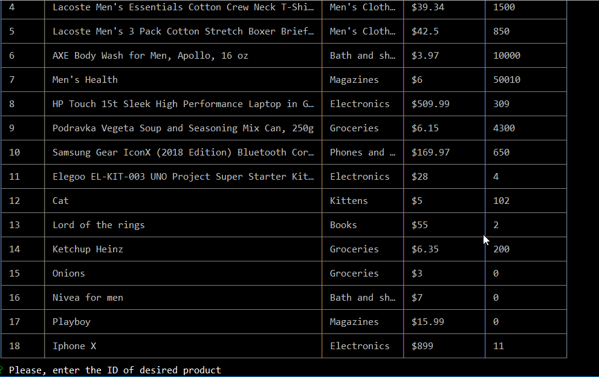
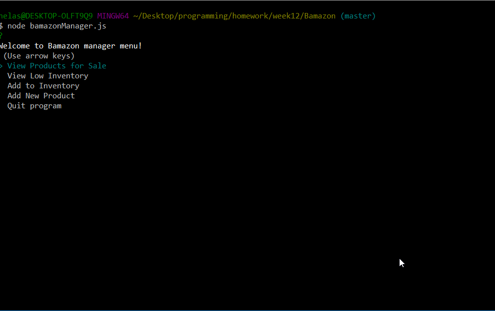

# Bamazon CLI store
### Bamazon is an Amazon-like SQL based app that has 2 possible user interfaces: Bamazon customer and Bamazon manager

#### Bamazon customer allows user to view items available in the store and shop available items
#### Bamazon manager allows user to manage this store: view items, view low inventory, restock items and add new items to the store

##### To start this app on your machine:
* Pull this repo
* In your bash type: 'npm install -y'
* Using bamazon.sql file, create a database for your store
* Using seeds.sql file, seed your database with new goods
* Your Bamazon Store is ready to use, just type in: 'node bamazonCustomer' or 'node 'bamazonManager'

## _Bamazon customer_
Bamazon customer allows user to view items available in the store and buy them

* **Purchasing process** 
To buy an item you need to type it's ID in the command line and then enter quantity of this item you'd like to purchase
Once user enters all required prompts, his total due appears on the screen and amount of items purchased gets deducted from 
the quantity column for this item
_note_: If you enter a non-existing id or transcending the stock quantity, program will let you know about that
User-friendly interface will help user easily perform all the necessary action in Bamazon store

## _Bamazon manager_
Bamazon manager allows user to view items available in the store, view items that the store is low on, restock items and add new ones

* **View Products for Sale**
This command allows user to view the item list of Bamazon store

* **View Low Inventory**
View Low Inventory command shows user a table of all the items that's stock quantity is below 5

* **Add to Inventory**
This command allows user to restock any item presented in the store. All you need is pick an item from the list and state the quantity
you want to add to stock

* **Add New Product**
Add New Product command allows user to add new items to the store. First you pick a department which new item belongs to(_If it doesn't
belong to any existing department, you'll be able to create a new department_). Then you state new item's name and quantity 
you want to put in stock. Last prompt will ask you about new item's price.

_This CLI application was created using following technologies:_
* **Node**
* **JavaScript**
* **API POST/GET methods**
* **Following NPM packages:**
    * "inquirer"
    * "cli-table"
    * "mysql"

